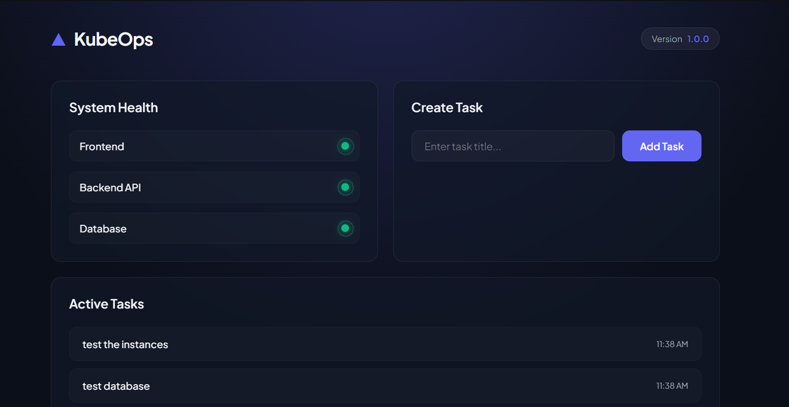

# KubeOps — Beginner's Kubernetes 3-Tier Stack Lab

Welcome to the **KubeOps Lab**! This project is designed for beginners to learn how to deploy and manage a real-world, 3-tier application stack on Kubernetes.

You will deploy a frontend dashboard, a backend API, and a PostgreSQL database.

---

## Dashboard Preview

Here is what the running application looks like once deployed:



---

## How the Application Fits Together

Think of this project as three lego blocks stacked together:

```text
  [ User Web Browser ]
           ↓
   [ Nginx Ingress ]  (Directs traffic based on URL paths)
      ↓         ↓
 [ Frontend ] [ Backend API ] ──→ [ PostgreSQL Database ]
 (HTML/CSS)   (Express Server)     (Persistent Storage)
```

1. **Frontend**: A web page that shows health indicators and lists tasks.
2. **Backend API**: A Node.js helper that listens for web requests, talks to the database, and sends answers back.
3. **Database**: A PostgreSQL database that securely stores your tasks.

---

## Directory Structure

Here are the files we will work with:

```text
kubeops/
├── frontend/
│   ├── Dockerfile       (Builds the frontend container)
│   ├── index.html       (Webpage layout)
│   ├── style.css        (Webpage styling)
│   ├── app.js           (Webpage interactive logic)
│   └── nginx.conf       (Nginx routing settings)
│
├── backend/
│   ├── Dockerfile       (Builds the backend API container)
│   ├── package.json     (List of Node packages needed)
│   └── server.js        (Backend Express code)
│
└── k8s/
    ├── namespace.yaml            (Isolated cluster playground)
    ├── configmap.yaml            (Public configurations)
    ├── secret.yaml               (Private passwords)
    ├── postgres-statefulset.yaml (Stateful database container)
    ├── postgres-service.yaml     (Database connection endpoint)
    ├── backend-deployment.yaml   (Backend API containers)
    ├── backend-service.yaml      (Backend connection endpoint)
    ├── frontend-deployment.yaml  (Frontend web containers)
    ├── frontend-service.yaml     (Frontend connection endpoint)
    ├── ingress.yaml              (Route director)
    └── hpa.yaml                  (Auto-scaling rules)
```

---

## Beginner-Friendly Step-by-Step Guide

Follow these steps to run the lab on your local computer:

### Step 1: Install the Tools
Make sure you have installed:
- **Docker Desktop**: Runs container software.
- **Minikube**: Creates a single-node local Kubernetes cluster.
- **Kubectl**: The command-line tool to control Kubernetes.

### Step 2: Start your Cluster
Open PowerShell and run the command to spin up Minikube:
```powershell
minikube start --driver=docker --memory=4096 --cpus=2
```
*What this does:* Initializes a brand new local Kubernetes cluster inside Docker with 4GB of memory and 2 CPUs.

### Step 3: Enable the Ingress Addon
Run the command to enable the routing manager:
```powershell
minikube addons enable ingress
```
*What this does:* Activates Nginx Ingress inside Minikube to route external web browser requests into cluster services.

### Step 4: Deploy the Code Manifests
Apply all Kubernetes files to the cluster:
```powershell
kubectl apply -f k8s/
```
*What this does:* Reads all the configuration files inside the `k8s/` folder and creates the namespaces, configmaps, secrets, services, and deployments inside your cluster.

### Step 5: Expose the App to your Browser
Since the database and API run inside an isolated network, we need to bridge it to your local machine.

Run the port-forward command:
```powershell
kubectl port-forward svc/frontend-service 8080:80 -n kubeops
```
*What this does:* Maps the frontend web page running inside the cluster directly to `http://localhost:8080/` on your computer.

Now, open your browser and go to:
👉 **[http://localhost:8080/](http://localhost:8080/)**

You will see the dashboard running, database status showing "Online", and a fully interactive task list!

---

## Core Kubernetes Concepts for Beginners

### What is a Pod?
A Pod is the smallest deployable unit in Kubernetes. It contains one or more application containers (like Nginx or Node.js). Think of it as a wrapper around a single running container.

### What is a Deployment?
A Deployment acts as a manager for stateless pods. You tell it: *"I want exactly 2 replicas of the frontend running"*, and the Deployment controller works in the background to keep 2 pods running at all times, recreating them automatically if they crash.

### What is a StatefulSet?
Unlike a Deployment, a StatefulSet is used for stateful applications like databases (PostgreSQL). It ensures the database pod keeps its unique identity (e.g. name `postgres-0`) and reconnects to the exact same storage volume even if it gets rescheduled.

### What is a Service?
Pods are temporary and their internal IP addresses change constantly. A Service acts as a permanent phone number (a stable DNS endpoint and IP) for a group of pods so they can talk to each other reliably.

### What is an Ingress?
An Ingress directs traffic from the outside world into the cluster. It acts as a gatekeeper, reading the URL path (like `/api` or `/`) and forwarding the browser's request to the correct internal service.
